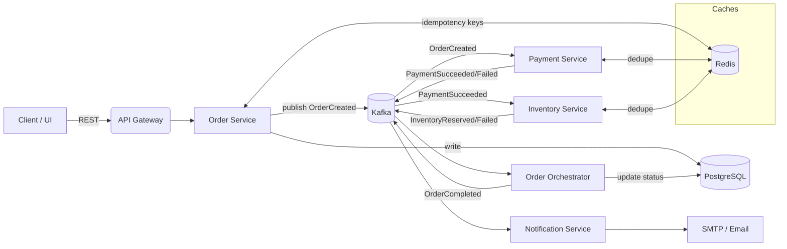
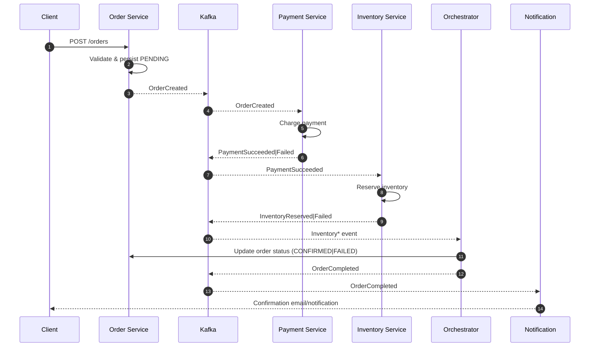
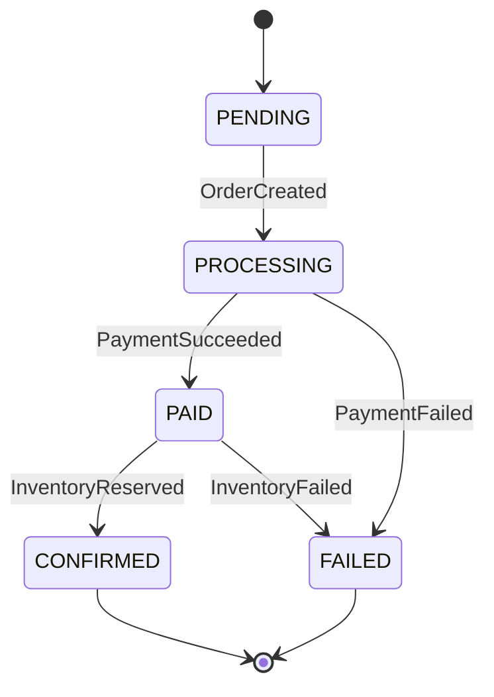

# 🚀 Real‑Time Event‑Driven Order Processing System


A production‑minded, event‑driven microservices system that processes orders in **real time**. It demonstrates **asynchronous workflows**, **loose coupling**, **effectively-once semantics**, **observability**, and **failure isolation** using a streaming backbone.

> Built to showcase practical system design for interviews, portfolios, and as a solid foundation for real projects.

---

## 🧭 Table of Contents

- [🎯 Why This Project?](#-why-this-project)
- [🏗️ Architecture](#️-architecture)
- [🧩 Services](#-services)
- [📬 Event Model](#-event-model)
- [🗺️ Diagrams](#️-diagrams)
- [⚙️ Running the System](#️-running-the-system)
- [🧾 Configuration](#-configuration)
- [🔌 API Reference](#-api-reference)
- [📡 Observability](#-observability)
- [🗄️ Data & State](#️-data--state)
- [🛡️ Reliability Patterns](#️-reliability-patterns)
- [🧪 Testing](#-testing)
- [🔁 CI/CD](#-cicd)
- [🔐 Security](#-security)
- [📈 Performance Notes](#-performance-notes)
- [🧰 Local Development Tips](#-local-development-tips)
- [🗓️ Roadmap](#️-roadmap)
- [❓ FAQ](#-faq)
- [📜 License](#-license)

---

## 🎯 Why This Project?

Traditional synchronous flows (order → inventory → payment → email) create tight coupling, long-tail latencies, and cascading failures. This system uses **events** to decouple steps:

- ⚡ **Fast responses** to users (enqueue and return).
- 📈 **Independent scaling** of services.
- 🧱 **Resilience** via retries, DLQs, and idempotency.
- 🧮 **Extensibility**: add new subscribers without touching the producer.

---

## 🏗️ Architecture

**High‑level flow**:

1. **Order API** receives `POST /orders` and validates basic fields.
2. Writes **Order** to DB as `PENDING`, emits **OrderCreated** event.
3. **Payment Service** consumes **OrderCreated**, attempts payment, emits **PaymentSucceeded**/**PaymentFailed**.
4. **Inventory Service** consumes **PaymentSucceeded**, reserves stock; on success emits **InventoryReserved**; on failure emits **InventoryFailed**.
5. **Order Orchestrator** (or Order Service subscriber) updates final order status (`CONFIRMED` or `FAILED`) and emits **OrderCompleted**.
6. **Notification Service** listens to **OrderCompleted** and sends email/notification.

> 📝 **Tip:** Partitions can be keyed by `orderId` to preserve ordering.

---

## 🧩 Services

| Service | Responsibility | Ports (default) |
|---|---|---|
| **api-gateway** (optional) | Routes external traffic to services | `8080` |
| **order-service** | REST API for orders, DB persistence, emits `OrderCreated`, projects final state | `8081` |
| **payment-service** | Consumes `OrderCreated`, processes payment, emits `PaymentSucceeded/Failed` | `8082` |
| **inventory-service** | Reserves/deducts stock on `PaymentSucceeded`, emits `InventoryReserved/Failed` | `8083` |
| **notification-service** | Sends email/notifications on `OrderCompleted` | `8084` |
| **orchestrator** (if separate) | Applies Saga/Process Manager logic across events | `8085` |
| **kafka / zookeeper** | Messaging backbone | `9092` |
| **postgres** | Orders (and possibly products) | `5432` |
| **redis** | Idempotency keys, caching | `6379` |

> If your repo merges orchestrator logic into the order-service, keep just that service.

---

## 📬 Event Model

**Topic naming (example):**

- `order.events` – `OrderCreated`, `OrderCompleted`
- `payment.events` – `PaymentSucceeded`, `PaymentFailed`
- `inventory.events` – `InventoryReserved`, `InventoryFailed`

**Common headers:** `eventId` (UUID), `traceId`, `spanId`, `correlationId`, `eventType`, `occurredAt` (ISO‑8601), `producer`.

**Event contracts:**

```jsonc
// OrderCreated
{
  "eventId": "b3e9d0da-6d1a-4f33-8a59-b7ca3e5bde3a",
  "traceId": "trace-123",
  "type": "OrderCreated",
  "occurredAt": "2026-02-05T14:30:10Z",
  "data": {
    "orderId": "ord_abc123",
    "userId": "usr_001",
    "items": [
      {"sku":"SKU-123","qty":2,"price":1200}
    ],
    "currency": "LKR",
    "total": 2400
  }
}
```

```jsonc
// PaymentSucceeded
{
  "type": "PaymentSucceeded",
  "data": {
    "orderId": "ord_abc123",
    "paymentId": "pay_789",
    "amount": 2400,
    "provider": "Stripe",
    "authCode": "A1B2C3"
  }
}
```

```jsonc
// InventoryReserved
{
  "type": "InventoryReserved",
  "data": {
    "orderId": "ord_abc123",
    "reservations": [{"sku":"SKU-123","qty":2}],
    "warehouse": "WH-01"
  }
}
```

**Idempotency:** events include deterministic keys; consumers use Redis/DB dedupe tables to avoid double‑processing.

---

## 🗺️ Diagrams

> 🧩 **GitHub renders Mermaid** diagrams natively. Copy these as‑is.

### 📦 System Architecture (Flowchart)



### 🔄 Order Lifecycle (Sequence)



### 🧠 Order State Machine



---

## ⚙️ Running the System

### 1) Prerequisites

- 🐳 Docker & Docker Compose
- ☕ JDK 17+ (for local runs), Maven/Gradle
- 🧰 Make (optional)

### 2) Quick Start (Docker Compose)

```bash
# from repo root
docker compose up -d --build
# wait for kafka, postgres, services
```

Check services:

- Order API: http://localhost:8081/actuator/health
- Kafka UI (if included): http://localhost:8080
- PostgreSQL: `localhost:5432` (user/password from `.env`)

### 3) Local (no Docker)

Run infra externally (Kafka, Postgres, Redis), then:

```bash
# example with Maven
cd services/order-service && ./mvnw spring-boot:run
cd ../payment-service && ./mvnw spring-boot:run
cd ../inventory-service && ./mvnw spring-boot:run
cd ../notification-service && ./mvnw spring-boot:run
```

> 🔧 Update `application.yaml` for each service to point to your local infra.

---

## 🧾 Configuration

Create `.env` (or copy from `.env.example`) at repo root:

```env
# Kafka
KAFKA_BROKERS=localhost:9092
KAFKA_SECURITY_PROTOCOL=PLAINTEXT

# PostgreSQL
POSTGRES_HOST=localhost
POSTGRES_PORT=5432
POSTGRES_DB=orders
POSTGRES_USER=orders_user
POSTGRES_PASSWORD=changeme

# Redis
REDIS_HOST=localhost
REDIS_PORT=6379

# Email (Notification Service)
SMTP_HOST=smtp.example.com
SMTP_PORT=587
SMTP_USER=apikey
SMTP_PASSWORD=changeme
FROM_EMAIL=orders@example.com
```

In Docker, these are injected via `docker-compose.yml`.

---

## 🔌 API Reference

### Create Order

`POST /api/v1/orders`

```json
{
  "userId": "usr_001",
  "items": [
    {"sku": "SKU-123", "qty": 2, "price": 1200}
  ],
  "currency": "LKR"
}
```

**Responses**

- **202 Accepted**
  ```json
  {"orderId":"ord_abc123","status":"PENDING"}
  ```
- **400 Bad Request** – validation errors
- **409 Conflict** – duplicate client request id (if using `Idempotency-Key`)

**Headers**
- `Idempotency-Key: <uuid or hash>` (recommended)

### Get Order

`GET /api/v1/orders/{orderId}`

```json
{
  "orderId": "ord_abc123",
  "status": "CONFIRMED",
  "total": 2400,
  "timeline": [
    {"at":"2026-02-05T14:30:10Z","event":"OrderCreated"},
    {"at":"2026-02-05T14:30:11Z","event":"PaymentSucceeded"},
    {"at":"2026-02-05T14:30:12Z","event":"InventoryReserved"},
    {"at":"2026-02-05T14:30:12Z","event":"OrderCompleted"}
  ]
}
```

---

## 📡 Observability

- 📝 **Logs:** JSON logs with `traceId`/`correlationId`.
- 📏 **Metrics:** Micrometer → Prometheus (e.g., `orders_submitted`, `payments_failed_total`, consumer lag).
- 🔎 **Tracing:** OpenTelemetry (OTLP) to Jaeger/Tempo; Kafka instrumentation enabled.
- 📊 **Dashboards:** `./observability/` contains sample Grafana dashboards (if present).

---

## 🗄️ Data & State

- **PostgreSQL**
  - `orders(id, user_id, status, total, currency, created_at, updated_at)`
  - `order_items(order_id, sku, qty, price)`
  - `outbox(id, aggregate_id, event_type, payload, created_at, published_at)` *(for outbox pattern if implemented)*
- **Redis**
  - `idem:<clientKey>` TTL=24h for idempotent POSTs
  - `dedupe:<eventId>` to ensure once‑only consumer logic

---

## 🛡️ Reliability Patterns

- 📨 **Transactional Outbox + Poller:** publish events atomically with DB writes.
- 🔁 **Idempotent Consumers:** dedupe table/Redis key.
- ⏱️ **Retries:** exponential backoff; **DLQs** for poison messages.
- 🤝 **Saga / Orchestrator:** compensating actions (e.g., refund payment if inventory fails).
- 🚦 **Backpressure:** consumer concurrency, max poll interval, and circuit breakers.

---

## 🧪 Testing

- **Unit:** business logic, serializers/deserializers.
- **Contract:** Spring Cloud Contract / Pact (event & REST contracts).
- **Integration:** Testcontainers (Kafka, Postgres, Redis).
- **E2E:** happy path + failure injection (payment fail, inventory fail, timeouts).

Run tests:

```bash
./mvnw clean verify
# or per-module:
cd services/order-service && ./mvnw test
```

---

## 🔁 CI/CD

- **CI:** build, test, static analysis (SpotBugs/Checkstyle), build Docker images, publish to registry.
- **CD:** staging deploy (Compose/K8s), rolling updates, consumer lag checks before promotion.

See `.github/workflows/` if included; adjust registry credentials in repo secrets.

---

## 🔐 Security

- **API:** JWT (access tokens), rate limiting, input validation.
- **Secrets:** environment variables or secret manager; never commit secrets.
- **Network:** only brokers and service ports are exposed; use mTLS and ACLs in production.
- **PII:** keep out of events; if required, encrypt fields or send only references.

---

## 📈 Performance Notes

- Batch event production and consumption.
- Configure Kafka `acks=all`, idempotent producers, and appropriate partitions (e.g., by `orderId`).
- Cache hot paths (product catalog) with Redis.
- Database indexes on `orders(status, created_at)` and `order_items(order_id)`.

---

## 🧰 Local Development Tips

- Use **Makefile** shortcuts (if included):
  ```bash
  make up     # docker compose up -d
  make down   # docker compose down -v
  make logs   # tail all services
  make seed   # seed products/orders (if script exists)
  ```
- Use `kafkacat`/`kcat` to peek topics:
  ```bash
  kcat -b localhost:9092 -t order.events -C -o beginning -q
  ```

---

## 🗓️ Roadmap

- [ ] Add **search** (Elasticsearch) for orders
- [ ] **Kubernetes** manifests + Helm chart
- [ ] **Rate limiting** (API Gateway)
- [ ] **Payment provider sandbox** integration
- [ ] **Canary** + automated rollback
- [ ] **Blue/Green** database migrations (Liquibase/Flyway)

---

## ❓ FAQ

**Why event‑driven instead of synchronous orchestration?**  
Resilience, independent scaling, and extensibility. If one service is down, others keep working and messages retry later.

**What about exactly‑once?**  
We approximate using idempotent producers, deduping consumers, and transactional outbox. True global exactly‑once across multiple systems is non‑trivial; we aim for **effectively once**.

**How do I add a new subscriber (e.g., analytics)?**  
Create a new service, subscribe to the relevant topic (e.g., `order.events`), and handle events without changing existing producers.

---

## 📜 License

This project is licensed under the **MIT License** — see [LICENSE](LICENSE) for details.
